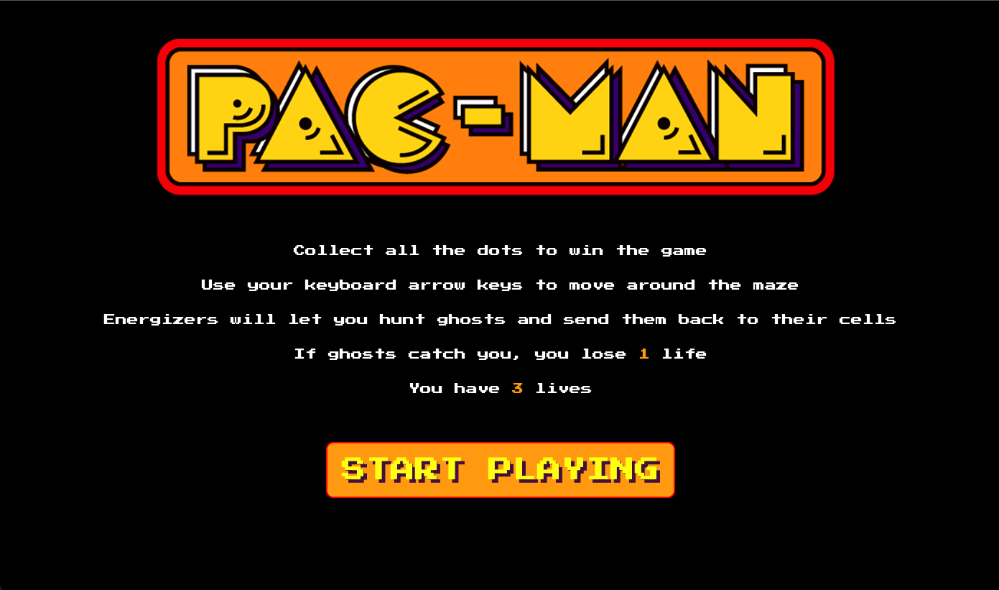
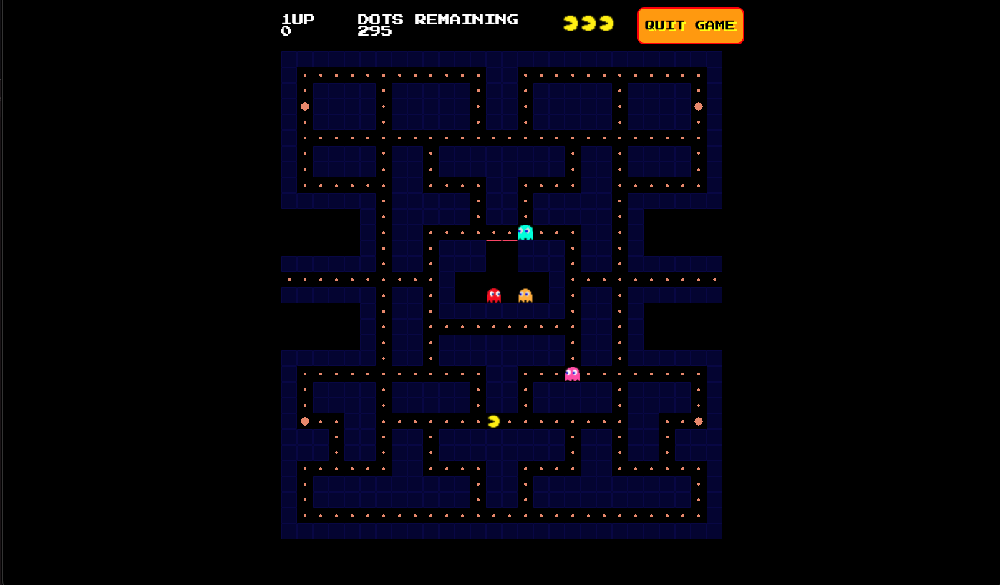
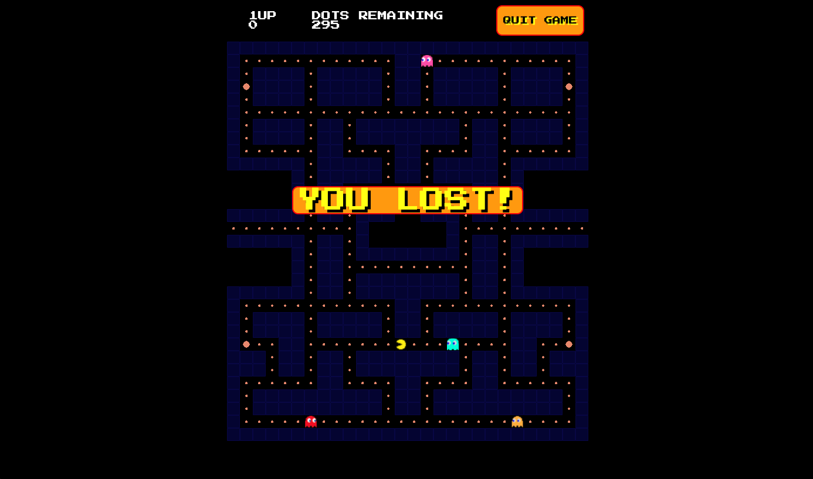
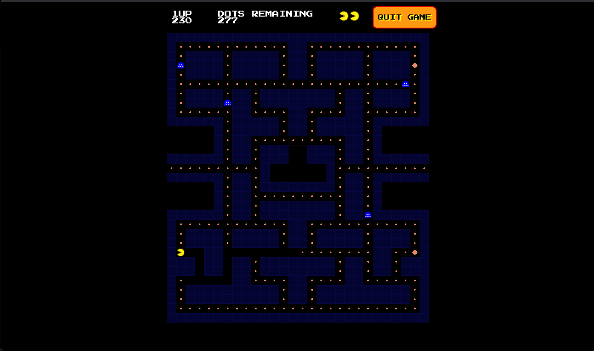

# Project-1: Pac-Man 

Pac-Man | Vanilla JavaScript, HTML & CSS | 1-week | Solo project

Deployed version of my game: - https://alaraayan.github.io/sei-project-1/ 

## Overview 
Tasked with building a grid-based game using Vanilla JavaScript. As a huge fan of the classic arcade game, I chose Pac-Man and tried to stay true to the original game as possible. The user controls the Pac-Man to collect all the dots while being pursued by pursuing ghosts who move around the maze. If caught, Pac-Man will lose one of his three lives; while eating a Power-Up will make him momentarily invincible.

## Brief
The brief given was to:
* **Render a game in the browser**
* **Design logic for winning** & **visually display which player won**
* **Include separate HTML / CSS / JavaScript files**
* Stick with **KISS (Keep It Simple Stupid)** and **DRY (Don't Repeat Yourself)** principles
* Use **Javascript** for **DOM manipulation**
* **Deploy your game online**, where the rest of the world can access it
* Use **semantic markup** for HTML and CSS (adhere to best practices)

## Techonologies Used
**Frontend**
- HTML5
- CSS3
- JavaScript(ES6)

**Dev Tools**
- Git
- GitHub
- Google Chrome dev tools
- VScode
- ESlint

 
## Key Learnings

This project changed my approach to projects a lot and really helped me put my coding process into perspective. I didn't spend much time in the planning stage as I was eager to start coding. This made me spend a lot of time refactoring my code about issues I could have foreseen in the wireframing stage. 

Also, as it was a solo project, and the first project we ever did, I didn't ask for help as much as I should have. I believed I should persevere and fix things myself, which in the end had the opposite effect and got me frustrated and I ended up losing time. These two points really taught me valuable lessons and I shifted my mindset moving forward.

Another key takeaway for me that translated into a bigger lesson was the movement of the ghosts. This turned out to be much more complex than I had initially thought, I ended up breaking things down a lot and taking it step by step which in the end helped me speed up. Seeing this was a real eye opener. It was also great to put into practice and consolidate everything I had been learning for the first month of the course.

## Future Features

If we had more time on this project I would add:
- A (The Office) themed Level-2
- Different characteristics for the ghosts
- The original Pac-Man theme song
- Highest score functionality using Local Storage

