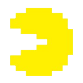
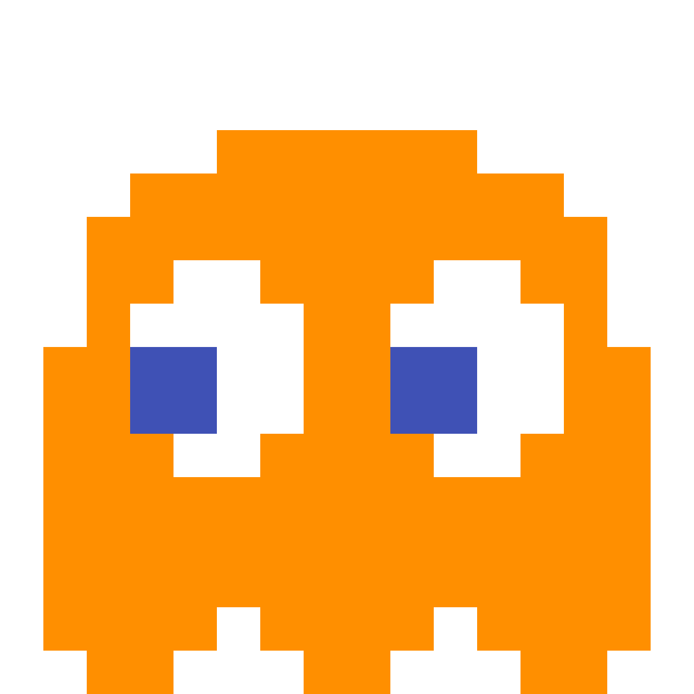
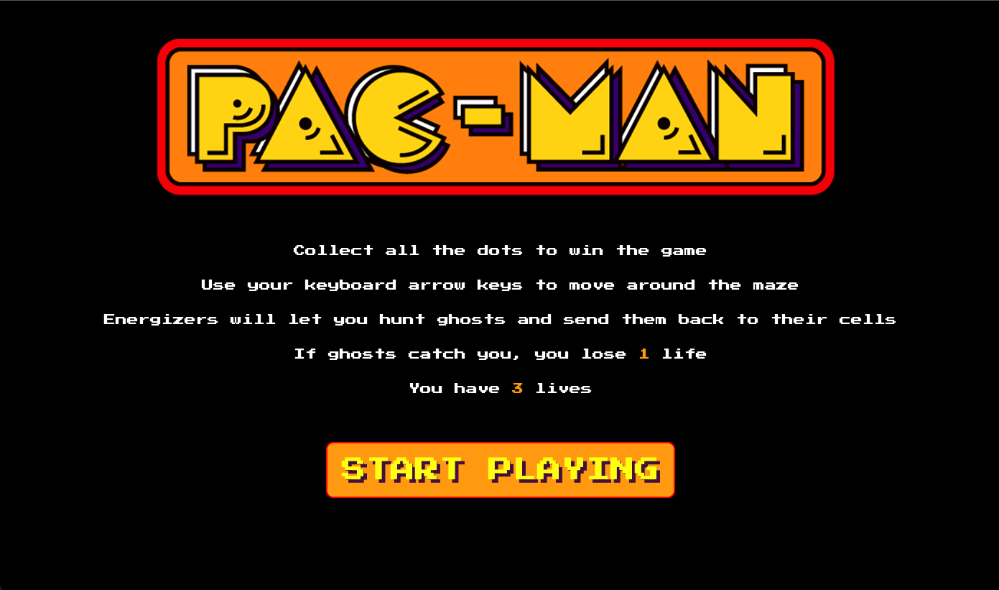
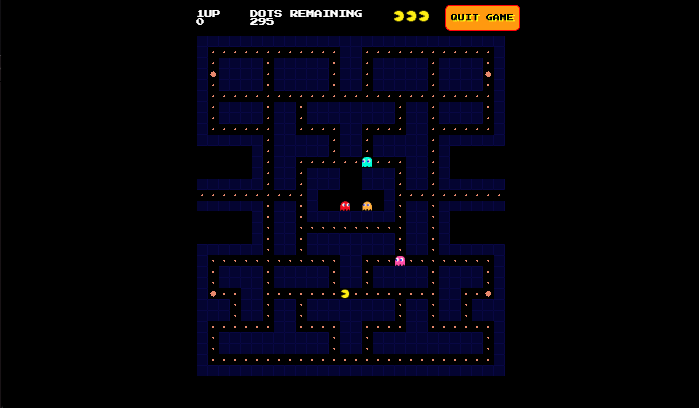
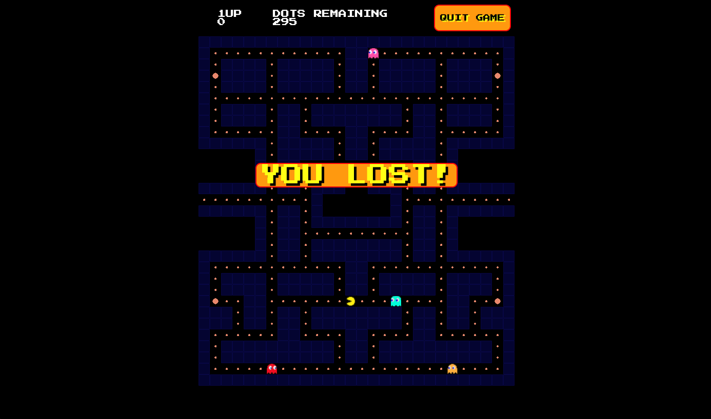
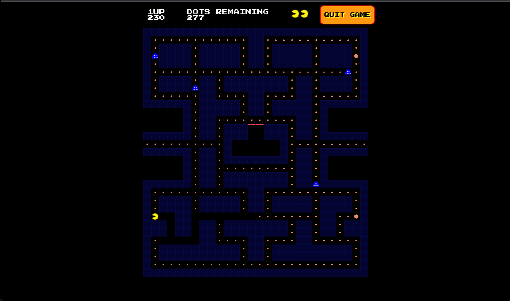

#  Project-1: Pac-Man 

#### General Assembly SEI Project-1 | Pac-Man | Vanilla JavaScript, HTML & CSS | 1-week | Solo project


Follow the link to play the game - https://alaraayan.github.io/sei-project-1/ 


## Overview 
For my first ever project on General Assembly's Software Engineering Immersive, I was tasked with building a grid-based game using Vanilla JavaScript. As a huge fan of the classic arcade game, I chose Pac-Man and tried to stay as true to the original as possible. The user controls the Pac-Man to collect all the dots while being pursued by ghosts who move around the maze. If caught, Pac-Man will lose one of his three lives; while eating a Power-Up will make him momentarily invincible.


## Brief
The brief given was to:
* **Render a game in the browser**
* **Design logic for winning** & **visually display which player won**
* **Include separate HTML / CSS / JavaScript files**
* Stick with **KISS (Keep It Simple Stupid)** and **DRY (Don't Repeat Yourself)** principles
* Use **Javascript** for **DOM manipulation**
* **Deploy your game online**, where the rest of the world can access it
* Use **semantic markup** for HTML and CSS (adhere to best practices)

## Techonologies Used
**Frontend**
- HTML5
- CSS3
- JavaScript(ES6)

**Dev Tools**
- Git
- GitHub
- Google Chrome dev tools
- VScode
- ESlint

## Process

<p>The first stages included setting up the grid and having the Pac-Man move along the maze. I didn't want to add in the ghosts until I felt comfortable with how Pac-Man was moving and eating dots accross the board.</p>

<p>Because of the unique shape of the Pac-Man grid I created arrays which specified various parts such as the tunnels and the den for the ghosts. 

Then I added the Pac-Man in and tested that it could move freely accross the grid, moving through the tunnel and appearing on the other side and not being able to enter the home of the ghosts. 

To finish the Pac-Man section of the game I added in the dots Pac-Man would be eating to win the game. 

After all the functionality for Pac-Man was tested, it was time to add the ghosts. I started with a single ghost (my favourite, Clyde ) and had him move around randomly. 

When Clyde started moving along his chosen path and randomly creating another one, I started working on his long awaited meeting with Pac-Man. I had to create a collision functionality for both Pac-Man and Clyde. This was fairly simple with added `if` statements inside their movement functions.
</p>

###### Pac-Man Runs Into Clyde

```
if ((cells[pacMan].classList.contains('ghost'))) {
  livesRemaining -= 1
}
```

###### Clyde Runs Into Pac-Man
```
if ((cells[inky].classList.contains('pacman'))) {
  livesRemaining -= 1
  updateLives(livesRemaining)
}
```

The only task I had remaining before adding the other ghosts was the Glow Mode . I originally had this as a separate function, but decided to refactor and add it into the existing movement functionalities for the ghosts and the Pac-Man. 

After adding the remaining ghosts, my MVP was finished. I then moved on to adding a starter screen, careographing the ghosts' sequence to get out of their home and adding the game won / lost functionalities.

## Screenshots
<p>
Start Screen

</p>
<p>
Game Screen

</p>
<p>
Result Pop-up

</p>
<p>
Glow Mode

</p>

## Challenges
<p>My main challenge was not the Pac-Man but the ghosts. The ghosts move along their path, and only once that path is no longer valid, they choose a new one randomly. I achieved this in the end with generating a random path for the ghost and then checking if the path is valid or not. And while the path is not clear, the ghost keeps generating a new one. 


###### Logic for finding a clear path
```
const ghostsNextMove = [+1, -1, +width, -width]
let isClear = false

function pathCheck(ghostName, path) {
  if (cells[ghostName += path].classList.contains('maze') || 
  (cells[ghostName += path].classList.contains('home')) { 
    isClear = false
  } else {
    isClear = true
  }
}
```

###### Clyde checks if his path is clear to start moving
```
function clydeMoves() {
  let ghostRandomPath = ghostsNextMove[Math.floor(Math.random() * ghostsNextMove.length)]
  setInterval(() => {
    pathCheck(clyde, ghostRandomPath)
    while (!isClear) {
      ghostRandomPath = ghostsNextMove[Math.floor(Math.random() * ghostsNextMove.length)]
      pathCheck(clyde, ghostRandomPath)
    }
  }, 150) 
  
}
```
###### After getting started on his path, Clyde still checks his path ahead before each move
```
if (isClear) {
      pathCheck(clyde, ghostRandomPath)
      cells[clyde].classList.remove('clyde')
      cells[clyde].classList.remove('ghost')
      cells[clyde].classList.remove('glow-ghosts')
      cells[clyde].classList.remove('glow-clyde')
      clyde += ghostRandomPath
}
```

## Wins
While getting the ghosts move was both my biggest challenge and my biggest win, I am also proud of my grid. The grid for Pac-Man is a classic and because I was trying to be true to the arcade game as much as possible, getting the it right was very important to me. And the way the result is displayed is also something that I had to work around because I was using Vanilla JavaScript. In the end I manipulated CSS to achieve the dynamic pop-up I was looking for. 

###### The result pop-up is not displayed during the game
```
wonButton.style.display = 'none'
```

###### After the game has finished, the pop-up appears and the game resets
```
function gameWon() {
  wonButton.style.display = 'flex'
  wonButton.addEventListener('click', gameReset())
}
```

Another win was the entire careography of the ghosts leaving their home and staying true to this pattern when they are back in there once they've been eaten by Pac-Man during Glow Mode. Each ghost leaves the home following a specific path and they do so one at a time. Once the second ghost starts the careography the first ghost is set with finding a path to get moving. I achieved this with a nested `setTimeout()`, allowing Clyde to only begin moving after Blinky's out on a path etc. 

```
setTimeout(function() {
    blinkyMoves()
    cells[clyde].classList.remove('clyde')
    cells[clyde].classList.remove('ghost')
    clyde -= 1
    cells[clyde].classList.add('clyde')
    cells[clyde].classList.add('ghost')
    setTimeout(function() {
      const clydeGetsOutInterval = setInterval(() => {
        cells[clyde].classList.remove('clyde')
        cells[clyde].classList.remove('ghost')
        clyde -= width
        cells[clyde].classList.add('clyde')
        cells[clyde].classList.add('ghost')
      }, 200)
      setTimeout(() => {
        clearInterval(clydeGetsOutInterval)
      }, 800)
    }, 200)
  }, 6000)
  setTimeout(function() {
    clydeMoves()
  }, 8000)
```

## Key Learnings
<p>It was great to put into practice and consolidate everything I had been learning for the first month of the course. Doing this project also really helped me put my coding process into perspective. I didn't spend much time in the planning stage as I was eager to start coding. This made me spend a lot of time refactoring my code about issues I could have foreseen in the wireframing stage. 

Also, as it was a solo project, and the first project we ever did, I didn't ask for help as much as I should have. I believed I should persevere and fix things myself, which in the end had the opposite effect and got me frustrated and I ended up losing time. These two points really taught me valuable lessons and I shifted my mindset moving forward.

Another key takeaway for me that translated into a bigger lesson, was the movement of the ghosts. This turned out to be much more complex than I had initially thought, I ended up breaking things down a lot and taking it step by step which in the end helped me speed up. Seeing this was a real eye opener. 
</p>

## Future Features

If we had more time on this project I would add:
- A (The Office) themed Level-2
- Different characteristics for the ghosts
- The original Pac-Man theme song
- Highest score functionality using Local Storage


